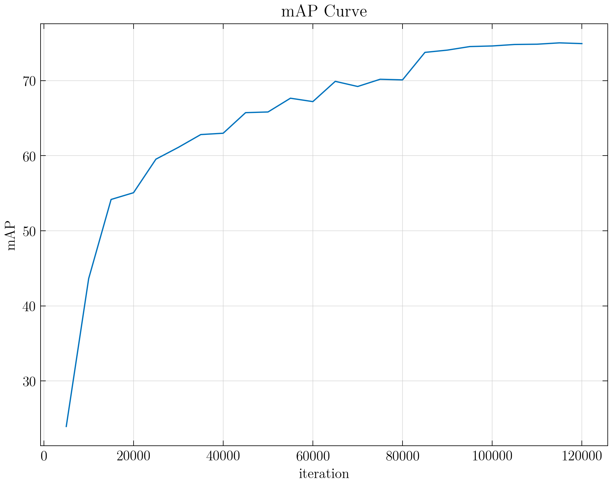

# SSD
An minimum implementation of SSD object detection using pytorch.

## Prepare environment
1. Create virtual environment:

    ```shell
    conda create -n SSD python=3.8
    conda activate SSD
    pip install -r requirements.txt
    ```

2. Install [pytorch](https://pytorch.org/), refer to the [blog](https://blog.csdn.net/qq_23013309/article/details/103965619) for details.


## Train
1. Download VOC2007 dataset from following website and unzip them:
   * http://host.robots.ox.ac.uk/pascal/VOC/voc2007/VOCtrainval_06-Nov-2007.tar
   * http://host.robots.ox.ac.uk/pascal/VOC/voc2007/VOCtest_06-Nov-2007.tar

2. Download pre-trained and fc-reduced `VGG16` model from [here](https://github.com/zhiyiYo/SSD/releases/download/v1.0.0/vgg16_reducedfc.pth).

3. Modify the value of `root` in `train.py`, please ensure that the directory structure of the `root` folder is as follows:

    ```txt
    root
    ├───Annotations
    ├───ImageSets
    │   ├───Layout
    │   ├───Main
    │   └───Segmentation
    ├───JPEGImages
    ├───SegmentationClass
    └───SegmentationObject
    ```

4. Start training:

    ```shell
    conda activate SSD
    python train.py
    ```

## Loss Curve
When `lr` is 5e-4, `batch_ size` is 8 and train on VOC2007 + VOC2012, the training loss curve is shown in following figure:


## Evaluation
### one model
1. Modify the value of `root` and `model_path` in `eval.py`.
2. Calculate mAP:

    ```sh
    conda activate SSD
    python eval.py
    ```

### multi models
1. Modify the value of `root` and `model_dir` in `evals.py`.
2. Calculate and plot mAP:

    ```shell
    conda activate SSD
    python evals.py
    ```

### mAP curve



### best mAP
| class       | AP     |
| ----------- | ------ |
| aeroplane   | 74.15% |
| bicycle     | 83.26% |
| bird        | 70.90% |
| boat        | 64.99% |
| bottle      | 42.33% |
| bus         | 85.87% |
| car         | 84.64% |
| cat         | 89.25% |
| chair       | 56.23% |
| cow         | 79.70% |
| diningtable | 72.67% |
| dog         | 85.87% |
| horse       | 88.80% |
| motorbike   | 84.49% |
| person      | 78.48% |
| pottedplant | 42.97% |
| sheep       | 76.03% |
| sofa        | 77.72% |
| train       | 86.43% |
| tvmonitor   | 75.85% |
| mAP         | 75.03% |

## Detection
1. Download `SSD_120000.pth` from [here](https://github.com/zhiyiYo/SSD/releases/download/v1.1.0/SSD_120000.pth).
2. Modify the value of `model_path` and `image_path` in `demo.py`.
3. Display detection results:

    ```shell
    conda activate SSD
    python demo.py
    ```


## Notes
1. Sometimes `loss` may become `nan`. If this happens, please reduce the value of `lr`.
2. 75.03% mAP may not be the limit of this project. This is the result of 7.5 hours of training on NVIDIA RTX 3090. You can try to increase the `batch_size` and `lr`, and then iterate 120000 times on the VOC2007 + VOC2012. The mAP should be higher. If you get a better result, please don't hesitate to tell me.
3. If you want to train custom dataset, here are some steps to follow:
   1. The label file must be in the same XML format as VOC2007, and the structure of dataset must be the same as follows:

        ```txt
        root
        ├───Annotations
        ├───ImageSets
        │   └───Main
        └───JPEGImages
        ```
   2. Put your `test.txt` and `train.txt` in the `Main` folder. These txt files must contain the names of the corresponding **jpg** format pictures. These names do not need a suffix.
   3. Modify the `classes` property of `VOCDataset` in `net/dataset.py` to include all the classes in your dataset.
   4. Change the `root` and `image_set` of `VOCDataset` in `train.py` and start training.


## Reference
* [[Paper] SSD: Single Shot MultiBox Detector](https://arxiv.org/abs/1512.02325)
* [[GitHub] amdegroot / ssd.pytorch](https://github.com/amdegroot/ssd.pytorch)


## License
```txt
MIT License

Copyright (c) 2021 Huang Zhengzhi

Permission is hereby granted, free of charge, to any person obtaining a copy
of this software and associated documentation files (the "Software"), to deal
in the Software without restriction, including without limitation the rights
to use, copy, modify, merge, publish, distribute, sublicense, and/or sell
copies of the Software, and to permit persons to whom the Software is
furnished to do so, subject to the following conditions:

The above copyright notice and this permission notice shall be included in all
copies or substantial portions of the Software.

THE SOFTWARE IS PROVIDED "AS IS", WITHOUT WARRANTY OF ANY KIND, EXPRESS OR
IMPLIED, INCLUDING BUT NOT LIMITED TO THE WARRANTIES OF MERCHANTABILITY,
FITNESS FOR A PARTICULAR PURPOSE AND NONINFRINGEMENT. IN NO EVENT SHALL THE
AUTHORS OR COPYRIGHT HOLDERS BE LIABLE FOR ANY CLAIM, DAMAGES OR OTHER
LIABILITY, WHETHER IN AN ACTION OF CONTRACT, TORT OR OTHERWISE, ARISING FROM,
OUT OF OR IN CONNECTION WITH THE SOFTWARE OR THE USE OR OTHER DEALINGS IN THE
SOFTWARE.
```